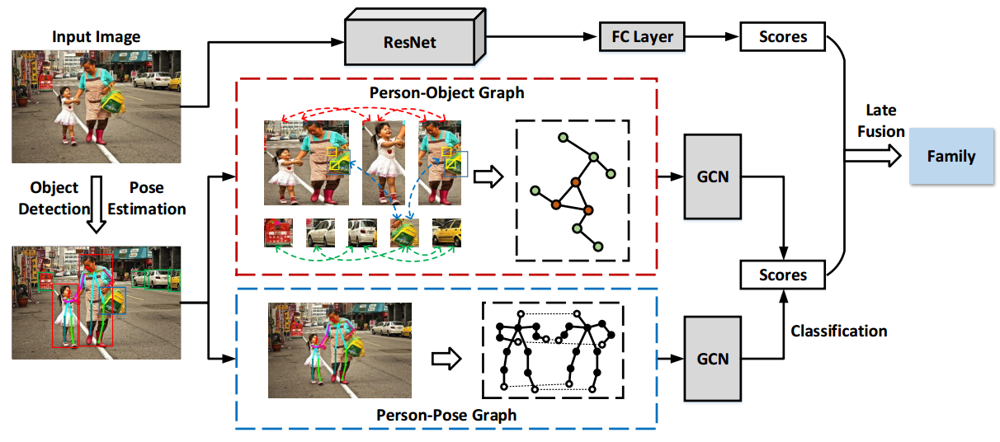
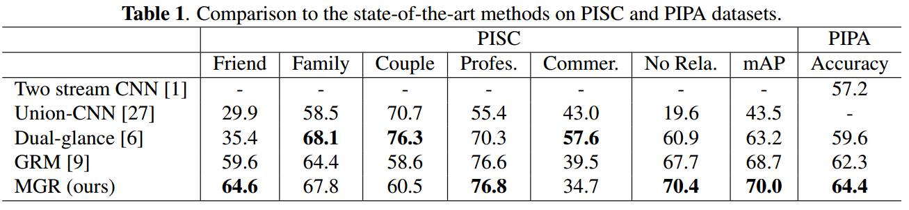
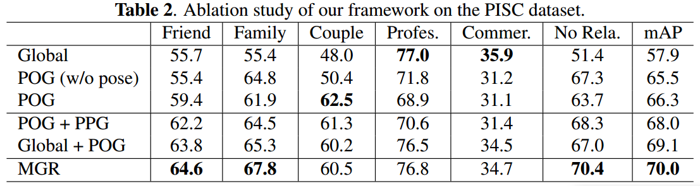

# MGR

## Multi-Granularity Reasoning for Social Relation Recognition from Images

### ABSTRACT

Discovering social relations in images can make machines better interpret the behavior of human beings.
However, automatically recognizing social relations in images is a challenging task due to the significant gap  between the domains of visual content and social relation.

Existing studies separately process various features such as faces expressions, body appearance, and contextual objects, thus they cannot comprehensively capture the multi-granularity semantics, such as scenes, regional cues of persons, and interactions among persons and objects.

To bridge the domain gap, we propose a Multi-Granularity Reasoning framework for social relation recognition from images.

The global knowledge and mid-level details are learned from the whole scene and the regions of persons and objects, respectively.

Most importantly, we explore the fine-granularity pose keypoints of persons to discover the interactions among persons and objects.

Specifically, the pose-guided Person-Object Graph and Person-Pose Graph are proposed to model the actions from persons to object and the interactions between paired persons, respectively.
Based on the graphs, social relation reasoning is performed by graph convolutional networks.

Finally, the global features and reasoned knowledge are integrated as a comprehensive representation for social relation recognition.

Extensive experiments on two public datasets show the effectiveness of the proposed framework.F

### Framework

### Experiments

### Requirements

Python 3.6

PyTorch 0.3

### Training

Train PersonPair_Union model[6] to extract person node feature as .

The code references git https://github.com/wzhouxiff/SR.git

